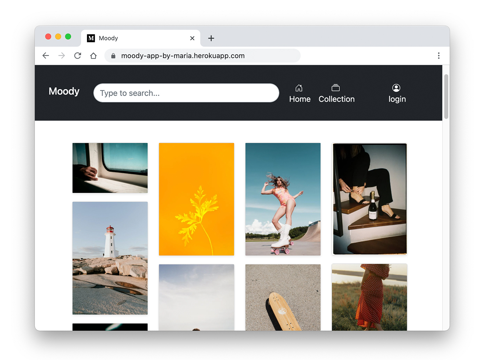
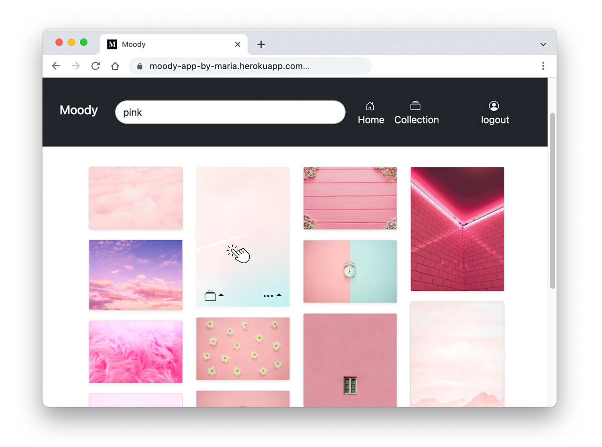
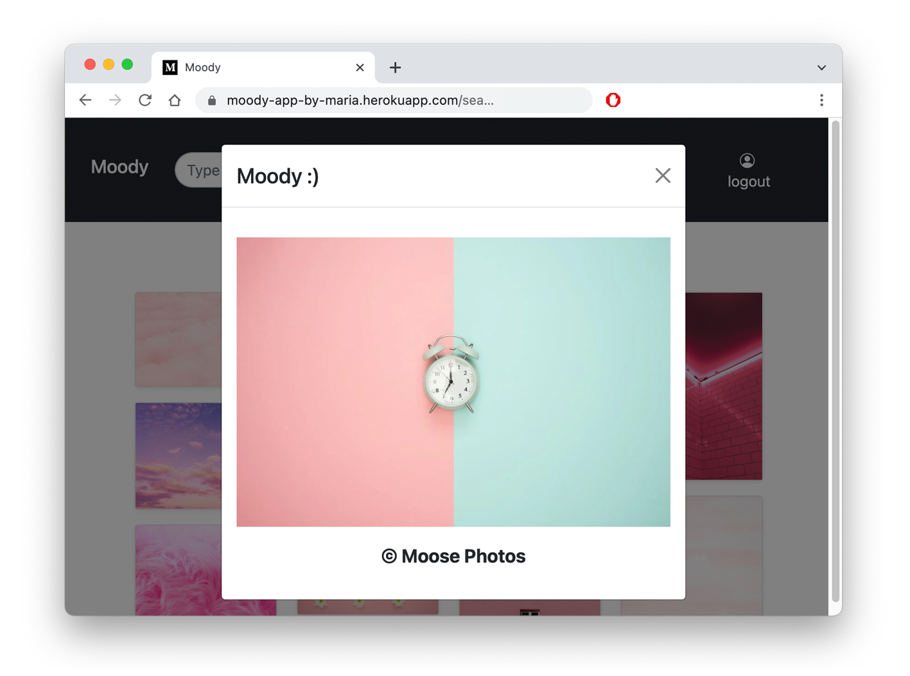
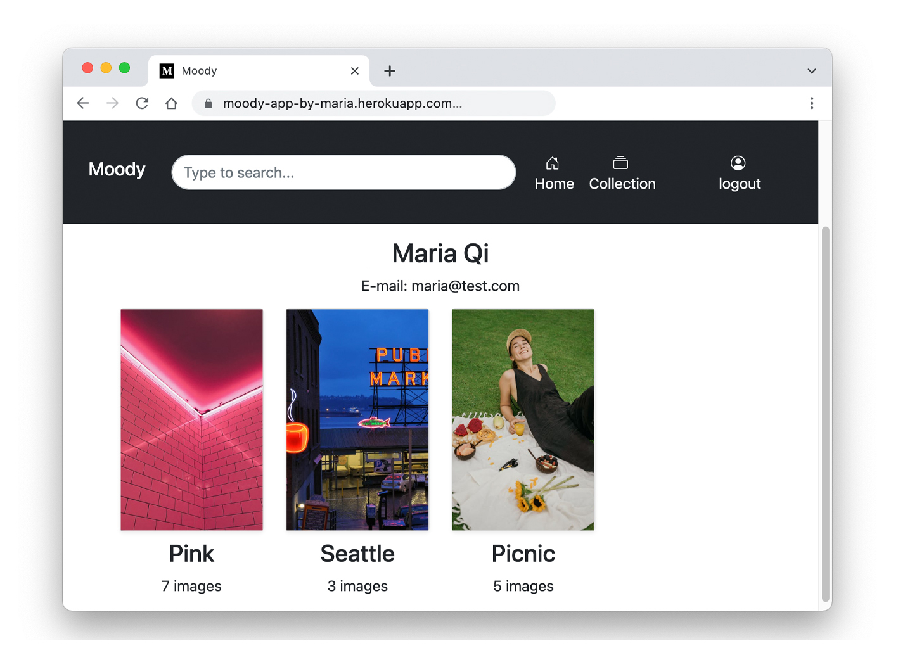
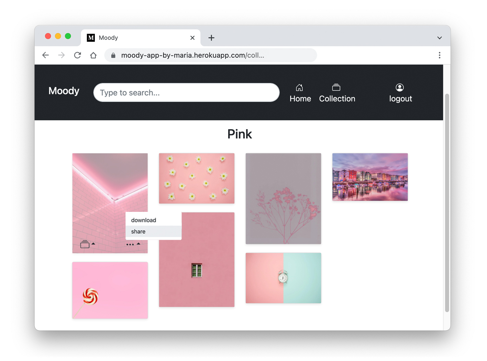

# **Moody, a simple mood board**

## **[🔗 Demo Here](https://moody-app-by-maria.herokuapp.com/)**

Moody is a minimalism mood board app that allows searching, saving, organizing and sharing images.

## **About The Project**

Moody uses [Pexels](https://www.pexels.com/) photo library and gives users access to millions of copyright free images.

### User could:

- search for images with any keywords

- create collection and add images

- sharing images between friends

  

## **Built with**

Moody is a MERN stack app

- React.js
- Node.js
- MongoDB
- Express.js
- Bootstrap
- Pexels API

## **Credits**

team member: Alvin Ng

## **License**

Distributed under the MIT License.

## **Contact**

Maria Qi
